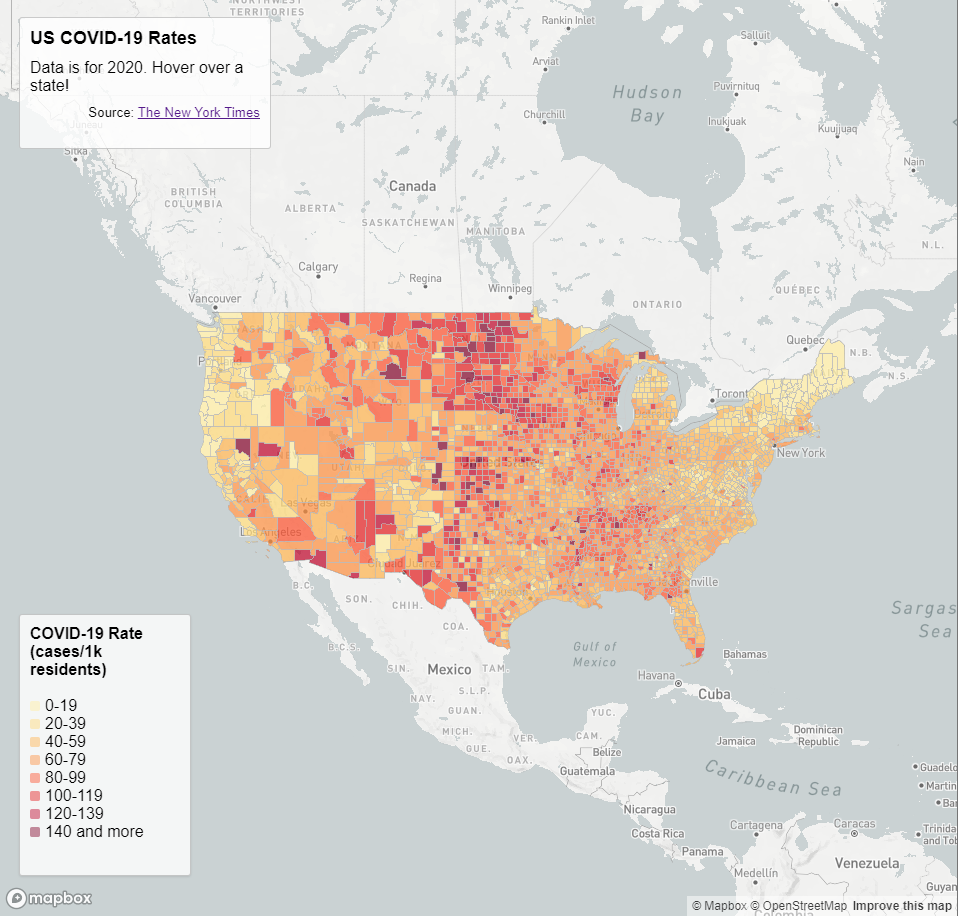
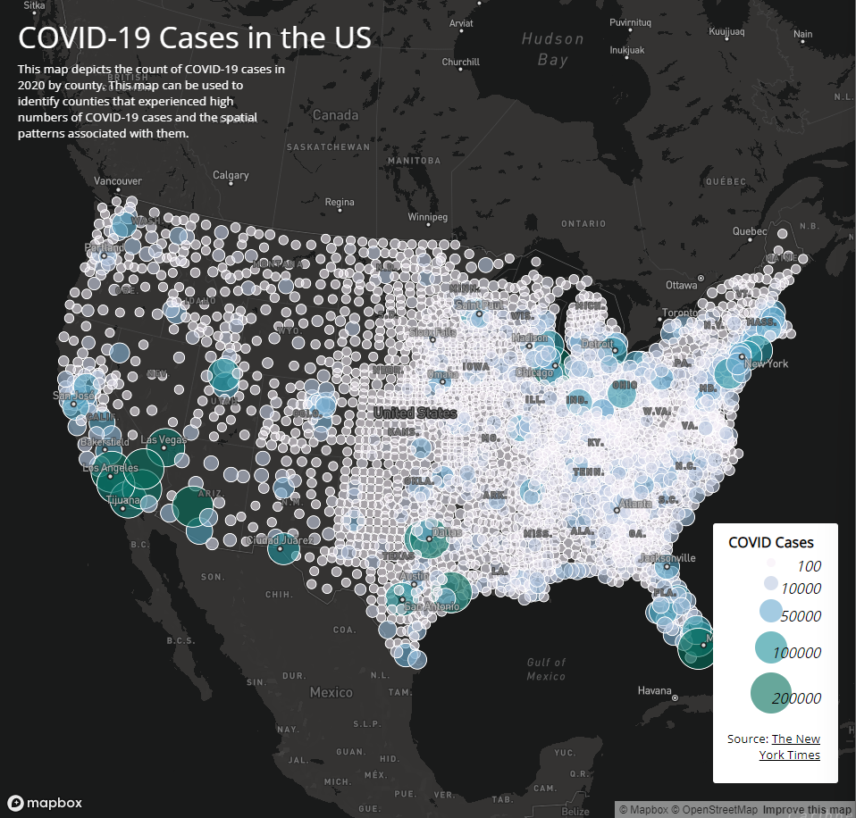

# Covid 19 Visualizations
## Introduction
In this project, I visualized COVID-19 data from 2020 in the United States. The data on COVID cases and rates per county is from the <a href="https://github.com/nytimes/covid-19-data/blob/43d32dde2f87bd4dafbb7d23f5d9e878124018b8/live/us-counties.csv">The New York Times</a>, and the population data is from the <a href="https://data.census.gov/cedsci/table?g=0100000US%24050000&d=ACS%205-Year%20Estimates%20Data%20Profiles&tid=ACSDP5Y2018.DP05&hidePreview=true">2018 ACS 5 year estimates</a>. This project contains two web map applications. Map 1 is a choropleth map of COVID-19 rates per county, calculated by taking the number of cases in 2020 per 1,000 residents. Map 2 is a proportional symbol map that shows the number of cases in each county with a circle that is larger and gets darker with the more cases a county has had in 2020. These maps were designed using the Mapbox Studio library. The basemaps are provided by OpenStreetMap.

## Map 1: <a href="https://Rsingh802.github.io/Covid_19_Visualizations/map1.html">US COVID-19 Rates</a>

This map allows the user to hover over various counties and have the COVID-19 rate for the selected county displayed in the top left box.

## Map 2: <a href="https://Rsingh802.github.io/Covid_19_Visualizations/map2.html">US COVID-19 Cases</a>

This map allows the user to click on the proportional symbol for a county and have the number of cases in that county displayed in a pop-up window.

### Acknowledgements
The structure and tutorials for both maps were developed by Bo Zhao. The COVID-19 data was processed by Steven Bao. The U.S. county boundary shapefile is from the <a href="https://www.census.gov/geographies/mapping-files/time-series/geo/carto-boundary-file.html">U.S. Census Bureau.</a>